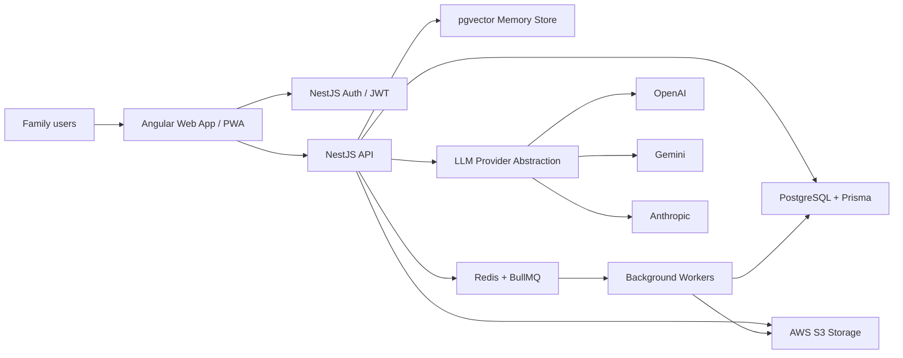
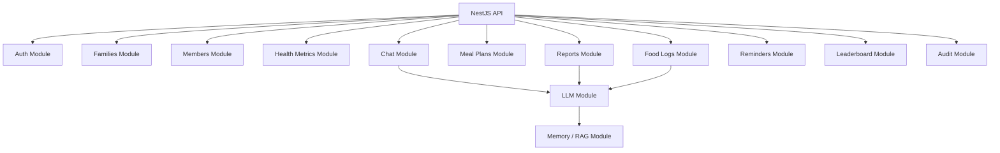
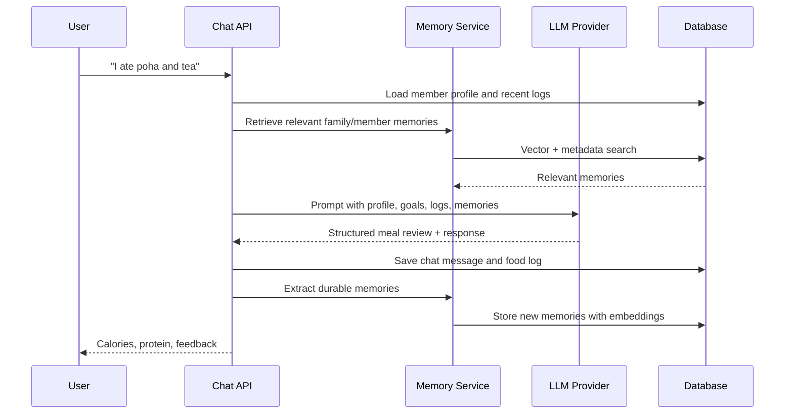
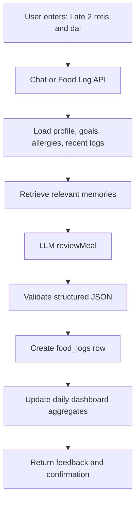
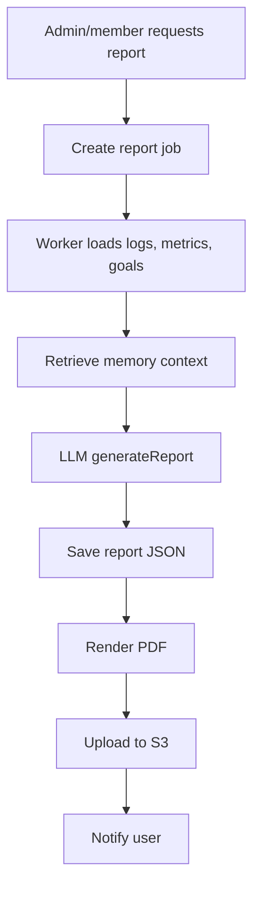

# Family Health Coach AI - Product & Engineering Blueprint

## 1. Product Summary

Family Health Coach AI is a multi-tenant web application for families to register members, track health goals, log meals, chat with an AI health coach, and review progress over time.

The AI coach acts as:

- Nutrition coach
- Meal reviewer
- Health tracker
- Accountability partner
- Progress reviewer
- Report generator

The platform supports many families, many members per family, role-based access, long-term member memory, and provider-agnostic LLM integrations across OpenAI, Gemini, and Anthropic.

## 2. Target Users

### Family Admin

Typical users: parent, caregiver, adult child managing parents, health-conscious family organizer.

Can:

- Register and manage family profile
- Add and edit family members
- View family-level reports
- View member reports
- Download PDFs
- Configure reminders
- Manage goals and preferences

### Family Member

Typical users: father, mother, child, grandparent, individual participant.

Can:

- View own dashboard
- Log meals, water, exercise, steps, weight, waist
- Chat with AI coach
- View own reports
- Receive reminders

## 3. Recommended Architecture

### Stack

- Frontend: Angular, TypeScript, Bootstrap CSS, Angular PWA
- Backend: NestJS, TypeScript
- Database: PostgreSQL
- ORM: Prisma
- Auth: NestJS Auth with Passport.js, JWT, and Google OAuth only
- Storage: AWS S3-compatible object storage
- AI providers: OpenAI, Gemini, Anthropic
- Vector/RAG: PostgreSQL with `pgvector` for phase 1-2, optional dedicated vector DB later
- Queue: BullMQ + Redis for report generation, reminders, photo parsing, long-running AI jobs
- PDF: Playwright or server-side PDF renderer
- Observability: OpenTelemetry, structured logs, audit logs
- CI/CD: GitHub Actions

### UI Stack Details

- Framework: Angular with TypeScript
- Styling: Bootstrap CSS with project-level SCSS overrides
- Layout: Bootstrap grid, spacing utilities, responsive breakpoints, and mobile-first components
- Components: Angular standalone components organized by feature
- Routing: Angular Router with lazy-loaded feature routes
- Forms: Angular Reactive Forms with shared validators
- API access: Angular `HttpClient` services with auth and error interceptors
- Auth protection: Angular route guards backed by NestJS JWT/Passport auth
- State: Angular services and signals for MVP; NgRx can be added later if state complexity grows
- PWA: Angular service worker, app manifest, offline shell, and push notification support
- Icons: Bootstrap Icons or another Angular-compatible icon package
- Theme: Bootstrap variables and SCSS overrides for light/dark mode

### System Context



### Backend Module Architecture



## 4. Multi-Tenancy Model

Use family-level tenancy.

Every protected domain table should include `familyId`.

Rules:

- A user may belong to one or more families in the future.
- A family admin can access all members in their family.
- A family member can only access their own profile, logs, chat, and reports.
- All backend queries must be scoped by `familyId`.
- Use service-layer tenant guards and Prisma middleware/query helpers.
- Keep audit logs for access to health data, report downloads, and admin changes.

## 5. Database Schema

### Prisma Schema Draft

```prisma
enum FamilyRole {
  FAMILY_ADMIN
  FAMILY_MEMBER
}

enum Gender {
  MALE
  FEMALE
  OTHER
  PREFER_NOT_TO_SAY
}

enum ActivityLevel {
  SEDENTARY
  LIGHT
  MODERATE
  ACTIVE
  VERY_ACTIVE
}

enum FoodPreference {
  VEGETARIAN
  JAIN
  VEGAN
}

enum LLMProviderName {
  OPENAI
  GEMINI
  ANTHROPIC
}

enum ChatRole {
  USER
  ASSISTANT
  SYSTEM
  TOOL
}

enum ReportType {
  DAILY
  WEEKLY
  MONTHLY
  FAMILY
}

model User {
  id            String             @id @default(cuid())
  email         String             @unique
  googleId      String?            @unique
  name          String?
  imageUrl      String?
  memberships   FamilyMembership[]
  createdAt     DateTime           @default(now())
  updatedAt     DateTime           @updatedAt
}

model Family {
  id             String             @id @default(cuid())
  name           String
  goals          Json?
  preferences    Json?
  memberships    FamilyMembership[]
  members        FamilyMember[]
  memories       FamilyMemory[]
  auditLogs      AuditLog[]
  createdAt      DateTime           @default(now())
  updatedAt      DateTime           @updatedAt
}

model FamilyMembership {
  id        String     @id @default(cuid())
  familyId  String
  userId    String
  role      FamilyRole
  family    Family     @relation(fields: [familyId], references: [id], onDelete: Cascade)
  user      User       @relation(fields: [userId], references: [id], onDelete: Cascade)
  createdAt DateTime   @default(now())

  @@unique([familyId, userId])
  @@index([userId])
}

model FamilyMember {
  id                    String             @id @default(cuid())
  familyId              String
  userId                String?
  name                  String
  age                   Int?
  gender                Gender?
  heightCm              Decimal?           @db.Decimal(6, 2)
  weightKg              Decimal?           @db.Decimal(6, 2)
  waistCm               Decimal?           @db.Decimal(6, 2)
  activityLevel         ActivityLevel?
  medicalConditions     String[]
  medications           String[]
  allergies             String[]
  foodPreferences       FoodPreference[]
  mealTimingPreferences Json?
  exercisePreferences   Json?
  family                Family             @relation(fields: [familyId], references: [id], onDelete: Cascade)
  user                  User?              @relation(fields: [userId], references: [id])
  healthMetrics         MemberHealthMetric[]
  goals                 MemberGoal[]
  foodLogs              FoodLog[]
  mealPlans             MealPlan[]
  dailyReports          DailyReport[]
  weeklyReports         WeeklyReport[]
  monthlyReports        MonthlyReport[]
  chatSessions          ConversationSession[]
  memories              MemberMemory[]
  createdAt             DateTime           @default(now())
  updatedAt             DateTime           @updatedAt

  @@index([familyId])
  @@index([userId])
}

model MemberHealthMetric {
  id              String    @id @default(cuid())
  familyId        String
  memberId        String
  measuredAt      DateTime
  weightKg        Decimal?  @db.Decimal(6, 2)
  waistCm         Decimal?  @db.Decimal(6, 2)
  hba1c           Decimal?  @db.Decimal(5, 2)
  ldl             Decimal?  @db.Decimal(6, 2)
  hdl             Decimal?  @db.Decimal(6, 2)
  triglycerides   Decimal?  @db.Decimal(6, 2)
  vitaminD        Decimal?  @db.Decimal(6, 2)
  hemoglobin      Decimal?  @db.Decimal(5, 2)
  energyScore     Int?
  staminaScore    Int?
  notes           String?
  member          FamilyMember @relation(fields: [memberId], references: [id], onDelete: Cascade)

  @@index([familyId, memberId, measuredAt])
}

model MemberGoal {
  id              String   @id @default(cuid())
  familyId        String
  memberId        String
  type            String
  targetValue     Decimal? @db.Decimal(8, 2)
  targetUnit      String?
  targetDate      DateTime?
  status          String   @default("ACTIVE")
  member          FamilyMember @relation(fields: [memberId], references: [id], onDelete: Cascade)
  createdAt       DateTime @default(now())
  updatedAt       DateTime @updatedAt

  @@index([familyId, memberId])
}

model FoodLog {
  id                    String   @id @default(cuid())
  familyId              String
  memberId              String
  loggedAt              DateTime
  source                String
  rawText               String?
  photoUrl              String?
  audioUrl              String?
  items                 Json
  estimatedCalories     Int?
  estimatedProteinG     Decimal? @db.Decimal(6, 2)
  estimatedCarbsG       Decimal? @db.Decimal(6, 2)
  estimatedFatG         Decimal? @db.Decimal(6, 2)
  adherenceScore        Int?
  coachFeedback         String?
  member                FamilyMember @relation(fields: [memberId], references: [id], onDelete: Cascade)
  createdAt             DateTime @default(now())
  updatedAt             DateTime @updatedAt

  @@index([familyId, memberId, loggedAt])
}

model MealPlan {
  id                String   @id @default(cuid())
  familyId          String
  memberId          String
  planDate          DateTime
  provider          LLMProviderName
  plan              Json
  caloriesTarget    Int?
  proteinTargetG    Decimal? @db.Decimal(6, 2)
  rationale         String?
  member            FamilyMember @relation(fields: [memberId], references: [id], onDelete: Cascade)
  createdAt         DateTime @default(now())
  updatedAt         DateTime @updatedAt

  @@index([familyId, memberId, planDate])
}

model ConversationSession {
  id          String        @id @default(cuid())
  familyId    String
  memberId    String
  title       String?
  messages    ChatMessage[]
  member      FamilyMember  @relation(fields: [memberId], references: [id], onDelete: Cascade)
  createdAt   DateTime      @default(now())
  updatedAt   DateTime      @updatedAt

  @@index([familyId, memberId])
}

model ChatMessage {
  id              String   @id @default(cuid())
  familyId        String
  sessionId       String
  role            ChatRole
  content         String
  structuredData  Json?
  provider        LLMProviderName?
  tokenUsage      Json?
  session         ConversationSession @relation(fields: [sessionId], references: [id], onDelete: Cascade)
  createdAt       DateTime @default(now())

  @@index([familyId, sessionId, createdAt])
}

model DailyReport {
  id              String   @id @default(cuid())
  familyId        String
  memberId        String
  reportDate      DateTime
  summary         Json
  calories        Int?
  proteinG        Decimal? @db.Decimal(6, 2)
  waterMl         Int?
  steps           Int?
  exerciseMinutes Int?
  adherenceScore  Int?
  member          FamilyMember @relation(fields: [memberId], references: [id], onDelete: Cascade)

  @@unique([memberId, reportDate])
  @@index([familyId, reportDate])
}

model WeeklyReport {
  id             String   @id @default(cuid())
  familyId       String
  memberId       String
  weekStartDate  DateTime
  summary        Json
  member         FamilyMember @relation(fields: [memberId], references: [id], onDelete: Cascade)

  @@unique([memberId, weekStartDate])
  @@index([familyId, weekStartDate])
}

model MonthlyReport {
  id              String   @id @default(cuid())
  familyId        String
  memberId        String
  monthStartDate  DateTime
  summary         Json
  member          FamilyMember @relation(fields: [memberId], references: [id], onDelete: Cascade)

  @@unique([memberId, monthStartDate])
  @@index([familyId, monthStartDate])
}

model PdfReport {
  id           String     @id @default(cuid())
  familyId     String
  memberId     String?
  reportType   ReportType
  reportId     String
  fileUrl      String
  generatedBy  String
  createdAt    DateTime   @default(now())

  @@index([familyId, memberId, createdAt])
}

model FamilyMemory {
  id          String   @id @default(cuid())
  familyId    String
  content     String
  metadata    Json?
  embedding   Unsupported("vector")?
  family      Family   @relation(fields: [familyId], references: [id], onDelete: Cascade)
  createdAt   DateTime @default(now())

  @@index([familyId])
}

model MemberMemory {
  id          String   @id @default(cuid())
  familyId    String
  memberId    String
  content     String
  metadata    Json?
  embedding   Unsupported("vector")?
  member      FamilyMember @relation(fields: [memberId], references: [id], onDelete: Cascade)
  createdAt   DateTime @default(now())

  @@index([familyId, memberId])
}

model Reminder {
  id          String   @id @default(cuid())
  familyId    String
  memberId    String
  type        String
  schedule    Json
  channel     String
  enabled     Boolean  @default(true)
  createdAt   DateTime @default(now())
  updatedAt   DateTime @updatedAt

  @@index([familyId, memberId])
}

model AuditLog {
  id          String   @id @default(cuid())
  familyId    String
  actorUserId String?
  action      String
  resource    String
  resourceId  String?
  metadata    Json?
  ipAddress   String?
  userAgent   String?
  family      Family   @relation(fields: [familyId], references: [id], onDelete: Cascade)
  createdAt   DateTime @default(now())

  @@index([familyId, createdAt])
}
```

## 6. AI Provider Abstraction

### TypeScript Interface

```ts
export interface LLMProvider {
  generateMealPlan(input: GenerateMealPlanInput): Promise<MealPlanResult>;
  reviewMeal(input: ReviewMealInput): Promise<MealReviewResult>;
  generateReport(input: GenerateReportInput): Promise<ReportResult>;
  chat(input: ChatInput): Promise<ChatResult>;
}

export type LLMProviderName = "openai" | "gemini" | "anthropic";

export interface ChatInput {
  familyId: string;
  memberId: string;
  sessionId: string;
  message: string;
  memoryContext: MemoryContext;
  recentMessages: ChatMessageDto[];
}

export interface ReviewMealInput {
  familyId: string;
  memberId: string;
  rawEntry: string;
  memberProfile: MemberProfileSnapshot;
  goals: GoalSnapshot[];
  memoryContext: MemoryContext;
}

export interface MealReviewResult {
  normalizedItems: Array<{
    name: string;
    quantity: string;
    calories: number;
    proteinG: number;
    confidence: number;
  }>;
  totalCalories: number;
  totalProteinG: number;
  adherenceScore: number;
  feedback: string;
  safetyNotes?: string[];
  memoryUpdates?: string[];
}
```

### Provider Classes

```ts
export class OpenAIProvider implements LLMProvider {}
export class GeminiProvider implements LLMProvider {}
export class AnthropicProvider implements LLMProvider {}

export class LLMProviderFactory {
  getProvider(name: LLMProviderName): LLMProvider {
    switch (name) {
      case "openai":
        return new OpenAIProvider();
      case "gemini":
        return new GeminiProvider();
      case "anthropic":
        return new AnthropicProvider();
    }
  }
}
```

## 7. Memory System

### Memory Types

- Family memory: household patterns, cuisines, shared preferences, shopping constraints, cooking habits
- Member memory: personal preferences, dislikes, routines, health goals, adherence patterns
- Health memory: trends and clinically relevant markers
- Conversation memory: durable facts extracted from chats

### RAG Flow



### Memory Extraction Rules

Store durable facts only:

- "Member dislikes oats"
- "Family usually eats Jain food on Mondays"
- "Mother prefers morning walks"
- "Father has LDL reduction goal"

Do not store:

- One-off temporary statements
- Sensitive medical speculation
- Unsupported diagnoses
- Full raw conversations as memory embeddings without filtering

## 8. REST API Contracts

Base URL: `/api/v1`

### Auth

| Method | Endpoint | Purpose |
|---|---|---|
| GET | `/auth/google` | Start Google OAuth |
| GET | `/auth/google/callback` | Complete Google OAuth callback |
| POST | `/auth/logout` | Logout |
| GET | `/auth/me` | Current user and memberships |

### Families

```http
POST /api/v1/families
```

Request:

```json
{
  "name": "Sharma Family",
  "goals": ["weight_loss", "better_energy"],
  "preferences": {
    "cuisine": ["Indian", "Gujarati"],
    "foodPreference": "VEGETARIAN"
  }
}
```

Response:

```json
{
  "id": "fam_123",
  "name": "Sharma Family",
  "role": "FAMILY_ADMIN"
}
```

Endpoints:

| Method | Endpoint | Role |
|---|---|---|
| GET | `/families` | Authenticated |
| POST | `/families` | Authenticated |
| GET | `/families/:familyId` | Family member |
| PATCH | `/families/:familyId` | Family admin |
| DELETE | `/families/:familyId` | Family admin |

### Members

| Method | Endpoint | Role |
|---|---|---|
| GET | `/families/:familyId/members` | Family admin |
| POST | `/families/:familyId/members` | Family admin |
| GET | `/families/:familyId/members/:memberId` | Admin or self |
| PATCH | `/families/:familyId/members/:memberId` | Admin or self |
| DELETE | `/families/:familyId/members/:memberId` | Family admin |

Create member request:

```json
{
  "name": "Amit",
  "age": 42,
  "gender": "MALE",
  "heightCm": 174,
  "weightKg": 84,
  "waistCm": 96,
  "activityLevel": "LIGHT",
  "medicalConditions": ["Prediabetes"],
  "medications": [],
  "allergies": ["Peanuts"],
  "foodPreferences": ["VEGETARIAN"],
  "mealTimingPreferences": {
    "breakfast": "08:30",
    "lunch": "13:00",
    "dinner": "20:00"
  },
  "exercisePreferences": {
    "preferredActivities": ["walking", "yoga"]
  }
}
```

### Health Metrics

| Method | Endpoint | Purpose |
|---|---|---|
| POST | `/families/:familyId/members/:memberId/health-metrics` | Add marker snapshot |
| GET | `/families/:familyId/members/:memberId/health-metrics` | List trends |
| GET | `/families/:familyId/members/:memberId/health-metrics/latest` | Latest markers |

### Chat

```http
POST /api/v1/families/:familyId/members/:memberId/chat/sessions
POST /api/v1/families/:familyId/members/:memberId/chat/sessions/:sessionId/messages
GET  /api/v1/families/:familyId/members/:memberId/chat/sessions/:sessionId/messages
```

Message request:

```json
{
  "message": "I ate poha and tea",
  "provider": "openai"
}
```

Message response:

```json
{
  "assistantMessage": {
    "content": "That sounds like roughly 320 calories and 8g protein. Add a protein source later today, like curd or paneer.",
    "structuredData": {
      "intent": "meal_log",
      "foodLogId": "log_123",
      "estimatedCalories": 320,
      "estimatedProteinG": 8,
      "adherenceScore": 74
    }
  }
}
```

### Food Logging

| Method | Endpoint | Purpose |
|---|---|---|
| POST | `/families/:familyId/members/:memberId/food-logs/manual` | Manual structured entry |
| POST | `/families/:familyId/members/:memberId/food-logs/natural-language` | Natural language entry |
| POST | `/families/:familyId/members/:memberId/food-logs/photo` | Photo upload |
| POST | `/families/:familyId/members/:memberId/food-logs/voice` | Voice upload |
| GET | `/families/:familyId/members/:memberId/food-logs?date=YYYY-MM-DD` | Daily logs |
| PATCH | `/families/:familyId/members/:memberId/food-logs/:logId` | Correct estimate |
| DELETE | `/families/:familyId/members/:memberId/food-logs/:logId` | Delete log |

### Meal Plans

| Method | Endpoint | Purpose |
|---|---|---|
| POST | `/families/:familyId/members/:memberId/meal-plans/generate` | Generate personalized plan |
| GET | `/families/:familyId/members/:memberId/meal-plans?date=YYYY-MM-DD` | Get plan |
| PATCH | `/families/:familyId/members/:memberId/meal-plans/:planId` | Edit plan |

### Dashboard

```http
GET /api/v1/families/:familyId/members/:memberId/dashboard?date=YYYY-MM-DD
```

Response:

```json
{
  "date": "2026-06-04",
  "caloriesConsumed": 1240,
  "proteinConsumedG": 52,
  "waterConsumedMl": 1800,
  "exerciseMinutes": 30,
  "steps": 7200,
  "weightTrend": [{ "date": "2026-06-01", "weightKg": 84.2 }],
  "waistTrend": [{ "date": "2026-06-01", "waistCm": 96 }],
  "energyScore": 7,
  "staminaScore": 6,
  "adherenceScore": 78
}
```

### Reports

| Method | Endpoint | Purpose |
|---|---|---|
| POST | `/families/:familyId/members/:memberId/reports/daily/generate` | Generate daily report |
| POST | `/families/:familyId/members/:memberId/reports/weekly/generate` | Generate weekly report |
| POST | `/families/:familyId/members/:memberId/reports/monthly/generate` | Generate monthly report |
| POST | `/families/:familyId/reports/family/generate` | Generate family report |
| POST | `/families/:familyId/reports/:reportId/pdf` | Generate PDF |
| GET | `/families/:familyId/reports/:reportId/pdf` | Download PDF |

### Leaderboard

```http
GET /api/v1/families/:familyId/leaderboard?period=weekly
```

Response:

```json
{
  "bestAdherence": [{ "memberId": "mem_1", "name": "Amit", "score": 86 }],
  "mostImproved": [{ "memberId": "mem_2", "name": "Neha", "delta": 12 }],
  "highestActivity": [{ "memberId": "mem_3", "name": "Riya", "steps": 61000 }],
  "mostConsistent": [{ "memberId": "mem_1", "name": "Amit", "daysLogged": 7 }]
}
```

### Reminders

| Method | Endpoint | Purpose |
|---|---|---|
| GET | `/families/:familyId/members/:memberId/reminders` | List reminders |
| POST | `/families/:familyId/members/:memberId/reminders` | Create reminder |
| PATCH | `/families/:familyId/members/:memberId/reminders/:reminderId` | Update reminder |
| DELETE | `/families/:familyId/members/:memberId/reminders/:reminderId` | Delete reminder |

## 9. UI Structure

### App Navigation

Mobile-first layout:

- Bottom tabs: Dashboard, Chat, Log, Progress, Family
- Admin-only secondary actions: Members, Reports, Settings
- Desktop layout: left sidebar + main workspace

### Screens

#### Login

```text
+--------------------------------+
| Family Health Coach AI          |
|                                |
| [ Continue with Google ]        |
|                                |
| Secure sign-in for families     |
+--------------------------------+
```

#### Daily Dashboard

```text
+--------------------------------+
| Today                  [Avatar] |
| Sharma Family                  |
|                                |
| Calories   Protein             |
| 1240/1800   52g/90g            |
|                                |
| Water      Steps               |
| 1.8L       7,200               |
|                                |
| Adherence Score                |
| [=======>---] 78               |
|                                |
| Weight Trend                   |
| [line chart]                   |
|                                |
| Coach Note                     |
| Add protein at dinner.          |
+--------------------------------+
```

#### WhatsApp-Style Chat

```text
+--------------------------------+
| Amit's Coach             [...] |
|--------------------------------|
| AI: Good morning. Breakfast?    |
|                         You:   |
|        I ate poha and tea       |
| AI: Estimated 320 kcal, 8g...   |
|                                |
| [ + ] [Type a message...] [mic] |
+--------------------------------+
```

Expected chat actions:

- Text entry
- Attach photo
- Voice input
- Quick chips: "Log meal", "Tomorrow plan", "Review today", "Water"
- Streaming AI response
- Structured food-log confirmation card

#### Meal Logging

```text
+--------------------------------+
| Log Meal                       |
| [Text] [Photo] [Voice] [Manual]|
|                                |
| What did you eat?              |
| [2 rotis and dal__________]    |
| [Estimate]                     |
|                                |
| Parsed Items                   |
| Roti x2       220 kcal 6g P    |
| Dal 1 bowl    180 kcal 10g P   |
|                                |
| [Save Log]                     |
+--------------------------------+
```

#### Progress

```text
+--------------------------------+
| Progress                       |
| [Weight] [Waist] [HbA1c] [LDL] |
|                                |
| Weight                         |
| [line chart]                   |
|                                |
| Goals                          |
| Waist reduction     40%         |
| Energy improvement  65%         |
+--------------------------------+
```

#### Family Admin

```text
+--------------------------------+
| Family                         |
| Sharma Family           [Edit] |
|                                |
| Members                        |
| Amit       Father      [View]  |
| Neha       Mother      [View]  |
| Riya       Child       [View]  |
|                                |
| [Add Member]                   |
|                                |
| Reports                        |
| [Weekly Family Report]         |
+--------------------------------+
```

## 10. Folder Structure

Recommended monorepo:

```text
family-health-coach-ai/
  apps/
    web/
      src/
        app/
          core/
            api/
            auth/
            guards/
            interceptors/
            services/
          shared/
            components/
            pipes/
            directives/
          features/
            auth/
              login/
            dashboard/
            chat/
            meals/
            progress/
            reports/
            family/
            admin/
          app.routes.ts
          app.config.ts
        assets/
        styles/
          styles.scss
          bootstrap-overrides.scss
        manifest.webmanifest
      angular.json
      package.json
    api/
      src/
        main.ts
        app.module.ts
        auth/
        families/
        members/
        health-metrics/
        food-logs/
        meal-plans/
        chat/
        reports/
        reminders/
        leaderboard/
        llm/
          llm-provider.interface.ts
          llm-provider.factory.ts
          providers/
            openai.provider.ts
            gemini.provider.ts
            anthropic.provider.ts
        memory/
        storage/
        audit/
        common/
          guards/
          decorators/
          filters/
          interceptors/
      test/
      package.json
  packages/
    database/
      prisma/
        schema.prisma
        migrations/
      src/
        prisma.ts
    shared/
      src/
        types/
        schemas/
        constants/
    config/
  infra/
    docker-compose.yml
    terraform/
  docs/
  .github/
    workflows/
      ci.yml
  package.json
  pnpm-workspace.yaml
  turbo.json
```

## 11. Core Workflows

### Natural Language Meal Logging



### Report Generation



## 12. Security & Privacy

HIPAA-inspired practices:

- Encrypt data in transit with HTTPS.
- Encrypt sensitive data at rest where possible.
- Use least-privilege IAM policies for S3.
- Sign S3 URLs with short expiration.
- Never expose one family's data to another tenant.
- Add audit logs for report downloads, health metric views, admin edits, and member exports.
- Keep LLM prompts scoped to the active family and member only.
- Avoid sending unnecessary PHI to LLM providers.
- Redact or summarize sensitive data in logs.
- Add consent language for AI-generated guidance.
- Add disclaimer: not medical advice; consult clinicians for diagnosis/treatment.
- Rate-limit auth, chat, uploads, and report generation.
- Validate all AI JSON outputs with Zod.
- Use row-level security in PostgreSQL if operational maturity allows it.

## 13. Testing Strategy

### Unit Tests

- LLM provider factory
- Prompt builders
- JSON output validators
- Permission guards
- Dashboard aggregate calculations
- Leaderboard scoring
- Report summary calculations

### Integration Tests

- Family admin creates member
- Member cannot access another member's private report
- Natural language meal creates food log
- Chat message retains conversation history
- Report generation creates downloadable PDF record
- Tenant boundaries across two families

### E2E Tests

- Register -> create family -> add member -> chat meal log -> dashboard updates
- Admin downloads weekly report
- Mobile chat and meal logging flow

## 14. CI/CD Plan

GitHub Actions:

```yaml
name: ci

on:
  push:
  pull_request:

jobs:
  test:
    runs-on: ubuntu-latest
    services:
      postgres:
        image: pgvector/pgvector:pg16
        ports:
          - 5432:5432
        env:
          POSTGRES_PASSWORD: postgres
    steps:
      - uses: actions/checkout@v4
      - uses: pnpm/action-setup@v4
      - uses: actions/setup-node@v4
        with:
          node-version: 22
          cache: pnpm
      - run: pnpm install --frozen-lockfile
      - run: pnpm lint
      - run: pnpm typecheck
      - run: pnpm test
      - run: pnpm prisma migrate deploy
      - run: pnpm test:e2e
```

Deployment:

- Web: AWS Amplify, Netlify, Firebase Hosting, or static hosting behind a CDN
- API: AWS ECS/Fargate, Render, Fly.io, or Railway initially
- DB: managed PostgreSQL
- Redis: managed Redis
- S3: AWS S3
- Secrets: platform secret manager

## 15. Implementation Plan

### Phase 1 - Authentication, Families, Members, Chat

Goal: usable family/member system with AI chat and conversation history.

Deliverables:

- Monorepo scaffold
- Angular app with Bootstrap CSS, responsive layout, Angular PWA, and dark mode
- NestJS API
- PostgreSQL + Prisma setup
- NestJS Passport/JWT Google OAuth login
- Family creation
- Admin/member roles
- Member CRUD
- Chat session and messages
- LLM provider abstraction
- OpenAI provider first
- Basic memory storage without embeddings
- Tenant guards and audit logs

Acceptance criteria:

- A user can sign in with Google and create a family.
- Family admin can add/edit members.
- Member can chat with AI.
- Conversation history persists.
- API prevents cross-family access.

### Phase 2 - Meal Planning, Meal Logging, Progress Tracking

Goal: AI can review meals, create plans, and update dashboards.

Deliverables:

- Natural language meal logging
- Manual food logging
- Meal plan generation
- Food log structured parsing
- Daily dashboard
- Health metrics entry
- Weight and waist trends
- Energy/stamina/adherence scores
- Memory extraction
- `pgvector` embeddings
- Gemini and Anthropic providers

Acceptance criteria:

- "I ate 2 rotis and dal" creates a structured food log.
- "Create tomorrow's meal plan" generates a personalized plan.
- Dashboard updates after logs.
- Memory improves personalization over repeated chats.

### Phase 3 - Reports, PDFs, Leaderboard

Goal: family admins can review progress and export reports.

Deliverables:

- Daily reports
- Weekly reports
- Monthly reports
- Family reports
- PDF generation
- S3 PDF storage
- Leaderboard: adherence, improvement, activity, consistency
- Report jobs via queue
- Admin report dashboard

Acceptance criteria:

- Admin can generate and download PDF reports.
- Member can view own reports.
- Family leaderboard works for weekly and monthly periods.

### Phase 4 - Voice, Photos, Advanced Analytics

Goal: richer logging and deeper coaching intelligence.

Deliverables:

- Voice input transcription
- Photo meal upload
- Image-based meal estimation
- Reminder engine
- Push notifications for PWA
- Medication, water, meal, walking reminders
- Advanced analytics
- Goal prediction and plateau detection
- Optional GraphQL API

Acceptance criteria:

- User can log a meal by voice or photo.
- Reminders fire reliably.
- Progress reviews include trend insights and next-best actions.

## 16. MVP Build Order

1. Scaffold monorepo and base infrastructure.
2. Add Prisma schema and migrations.
3. Implement NestJS JWT/Passport Google OAuth and session handling.
4. Build family and member APIs.
5. Build dashboard shell and family/member screens.
6. Implement LLM abstraction and OpenAI chat.
7. Persist chat sessions/messages.
8. Add food log natural language flow.
9. Add dashboard aggregate endpoint.
10. Add reports and PDF generation.

## 17. Key Product Decisions

- Start with Angular and NestJS for a full TypeScript stack.
- Use PostgreSQL and `pgvector` before adding a separate vector database.
- Use family-level tenancy as the primary isolation boundary.
- Keep AI output structured and validated.
- Treat LLM estimates as estimates, not clinical facts.
- Build chat as the central interaction model, with dashboard/reporting as review surfaces.
- Implement OpenAI first, then add Gemini and Anthropic behind the same interface.

## 18. Suggested First Sprint

Duration: 2 weeks.

Scope:

- Repo scaffold
- Auth
- Family creation
- Member CRUD
- Chat UI
- Chat persistence
- OpenAI provider
- Basic audit logs
- Basic dashboard shell

Definition of done:

- Two families can use the system independently.
- Admin/member permissions work.
- Chat history is retained.
- AI can answer using member profile context.
- The UI is responsive on mobile and desktop.
