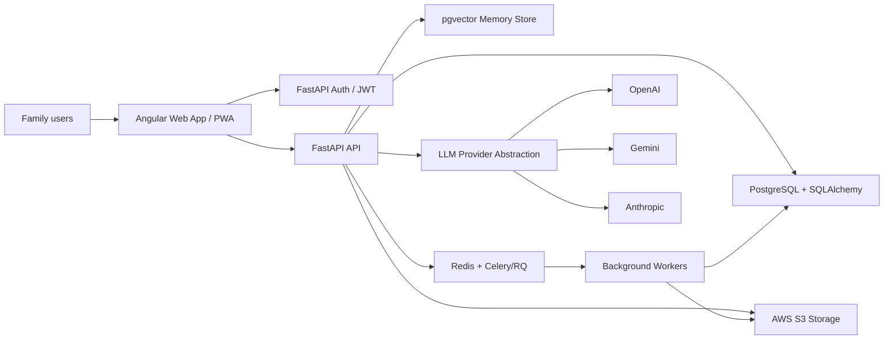
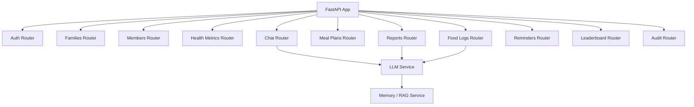
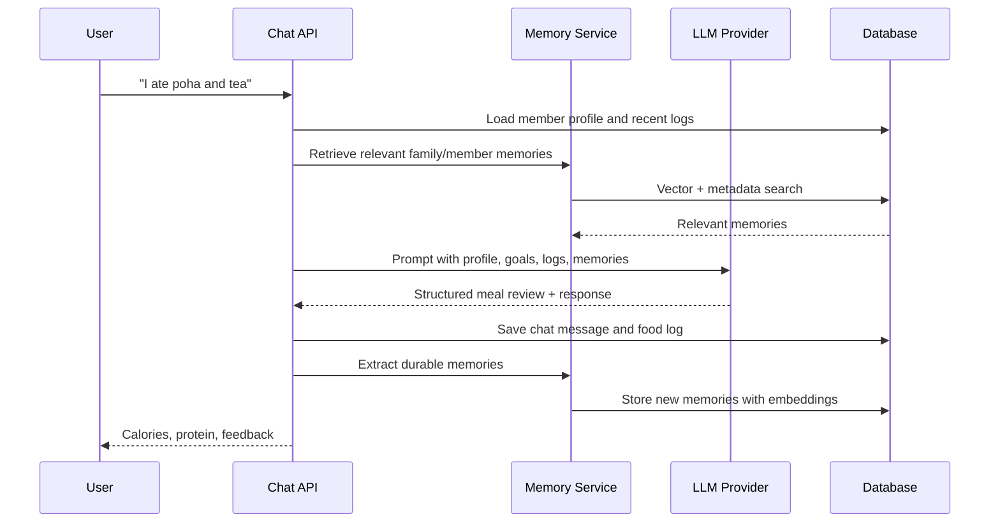
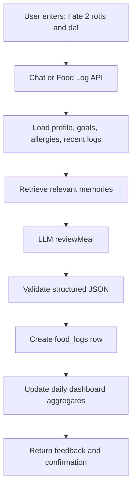
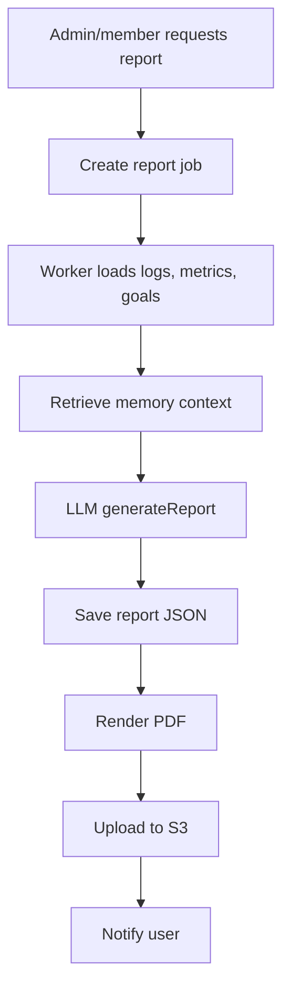

# Family Health Coach AI - Product & Engineering Blueprint

## 1. Product Summary

Family Health Coach AI is a multi-tenant web application for families to register members, track health goals, log meals, chat with an AI health coach, and review progress over time.

The AI coach acts as:

- Nutrition coach
- Meal reviewer
- Health tracker
- Accountability partner
- Progress reviewer
- Report generator

The platform supports one family per user account, many members per family, role-based access, long-term member memory, and provider-agnostic LLM integrations across OpenAI, Gemini, and Anthropic.

## Documentation Set

- `family-health-coach-ai-blueprint.md`: architecture, data model, API contracts, UI wireframes, security, and phases.
- `module-wise-development-plan.md`: module-by-module implementation plan, dependencies, tests, and module status tracker.
- `project-status.md`: current decisions, overall status, module status, and next recommended work.

These docs must stay in sync. When stack, scope, APIs, database design, module status, or implementation priorities change, update the relevant docs in the same commit and push the change.

Before every commit, run this stale-stack scan and fix any outdated references:

```bash
rg -n "N[e]xt\\.js|N[e]xtJS|n[e]xt\\.js|n[e]xtjs|T[a]ilwind|t[a]ilwind|s[h]adcn|A[u]th\\.js|N[e]stJS|P[r]isma|s[c]hema\\.prisma|R[e]act PDF|B[u]llMQ" . -g "!package-lock.json" -g "!node_modules/**"
```

## 2. Target Users

### Family Admin

Typical users: parent, caregiver, adult child managing parents, health-conscious family organizer.

Can:

- Register and manage family profile
- Add and edit family members
- View family-level reports
- View member reports
- Download PDFs
- Configure reminders
- Manage goals and preferences
- Perform any action inside the family they manage

### Family Member

Typical users: father, mother, child, grandparent, individual participant.

Can:

- View own dashboard
- Log meals, water, exercise, steps, weight, waist
- Chat with AI coach
- View own reports
- Receive reminders

### App Admin

Not exposed to end users in the MVP.

- No separate app-admin role in the product UI or user-facing auth flow.
- Family Admin is the highest role inside a family.
- App-level administration can be added later for internal support or operations if needed.

## 3. Recommended Architecture

### Stack

- Frontend: Angular, TypeScript, Bootstrap CSS, Angular PWA
- Backend: FastAPI, Python
- Database: PostgreSQL
- ORM: SQLAlchemy or SQLModel with Alembic migrations
- Auth: FastAPI Google OAuth with JWT session tokens
- Storage: AWS S3-compatible object storage
- AI providers: OpenAI, Gemini, Anthropic
- Vector/RAG: PostgreSQL with `pgvector` for phase 1-2, optional dedicated vector DB later
- Queue: Celery or RQ with Redis for report generation, reminders, photo parsing, and long-running AI jobs
- PDF: Playwright or server-side PDF renderer
- Observability: OpenTelemetry, structured logs, audit logs
- CI/CD: GitHub Actions

### Environment Strategy

Current priority: local-first development, with deployment readiness tracked for the Vercel + Render split.

- Build and run the full MVP locally before optimizing for hosted deployment.
- Use local Angular dev server for the web app.
- Use local FastAPI/Uvicorn for the API.
- Use local PostgreSQL, Redis, and S3-compatible storage through Docker Compose where possible.
- Keep environment variables in local `.env` files that are not committed.
- Keep deployment configuration lightweight until core modules are working.
- Target deployment path: Angular web app on Vercel, FastAPI API on Render, managed PostgreSQL, managed Redis, and S3-compatible object storage.
- Keep a deployment readiness checklist for the frontend API base URL, backend CORS, Google OAuth callback URI, database, Redis, and storage wiring.

### UI Stack Details

- Framework: Angular with TypeScript
- Styling: Bootstrap CSS with project-level SCSS overrides
- Layout: Bootstrap grid, spacing utilities, responsive breakpoints, and mobile-first components
- Components: Angular standalone components organized by feature
- Routing: Angular Router with lazy-loaded feature routes
- Forms: Angular Reactive Forms with shared validators
- API access: Angular `HttpClient` services with auth and error interceptors
- Auth protection: Angular route guards backed by FastAPI JWT auth
- State: Angular services and signals for MVP; NgRx can be added later if state complexity grows
- PWA: Angular service worker, app manifest, offline shell, and push notification support
- Icons: Bootstrap Icons or another Angular-compatible icon package
- Theme: Bootstrap variables and SCSS overrides for light/dark mode

### System Context



### Backend App Architecture



## 4. Multi-Tenancy Model

Use family-level tenancy.

Every protected domain table should include `familyId`.

Rules:

- A user may belong to only one family.
- A family admin can access all members in their family and manage any action inside that family.
- A family member can only access their own profile, logs, chat, and reports.
- All backend queries must be scoped by `familyId`.
- Use FastAPI dependencies and service-layer query helpers to enforce tenant scoping.
- Keep audit logs for access to health data, report downloads, and admin changes.

## 5. Database Schema

### Relational Schema Draft

Use SQLAlchemy or SQLModel models with Alembic migrations. Keep the schema simple and table-oriented for the MVP.

Core enums:

```python
class FamilyRole(str, Enum):
    FAMILY_ADMIN = "FAMILY_ADMIN"
    FAMILY_MEMBER = "FAMILY_MEMBER"

class Gender(str, Enum):
    MALE = "MALE"
    FEMALE = "FEMALE"
    OTHER = "OTHER"
    PREFER_NOT_TO_SAY = "PREFER_NOT_TO_SAY"

class ActivityLevel(str, Enum):
    SEDENTARY = "SEDENTARY"
    LIGHT = "LIGHT"
    MODERATE = "MODERATE"
    ACTIVE = "ACTIVE"
    VERY_ACTIVE = "VERY_ACTIVE"

class FoodPreference(str, Enum):
    VEGETARIAN = "VEGETARIAN"
    JAIN = "JAIN"
    VEGAN = "VEGAN"

class LLMProviderName(str, Enum):
    OPENAI = "OPENAI"
    GEMINI = "GEMINI"
    ANTHROPIC = "ANTHROPIC"
```

Recommended tables:

| Table | Purpose | Important Fields |
|---|---|---|
| `users` | Google-authenticated users | `id`, `email`, `google_id`, `name`, `image_url`, `created_at`, `updated_at` |
| `families` | Tenant boundary | `id`, `name`, `goals`, `preferences`, `created_at`, `updated_at` |
| `family_memberships` | User-to-family roles | `id`, `family_id`, `user_id`, `role`, `created_at` |
| `family_members` | Health profile for each person | `id`, `family_id`, `user_id`, `name`, `age`, `gender`, `height_cm`, `weight_kg`, `waist_cm`, `activity_level`, `medical_conditions`, `medications`, `allergies`, `food_preferences`, `meal_timing_preferences`, `exercise_preferences` |
| `member_health_metrics` | Time-series health markers | `id`, `family_id`, `member_id`, `measured_at`, `weight_kg`, `waist_cm`, `hba1c`, `ldl`, `hdl`, `triglycerides`, `vitamin_d`, `hemoglobin`, `energy_score`, `stamina_score`, `notes` |
| `member_goals` | Member goals | `id`, `family_id`, `member_id`, `type`, `target_value`, `target_unit`, `target_date`, `status` |
| `food_logs` | Structured food logs | `id`, `family_id`, `member_id`, `logged_at`, `source`, `raw_text`, `photo_url`, `audio_url`, `items`, `estimated_calories`, `estimated_protein_g`, `estimated_carbs_g`, `estimated_fat_g`, `adherence_score`, `coach_feedback` |
| `meal_plans` | AI-generated plans | `id`, `family_id`, `member_id`, `plan_date`, `provider`, `plan`, `calories_target`, `protein_target_g`, `rationale` |
| `conversation_sessions` | Chat sessions | `id`, `family_id`, `member_id`, `title`, `created_at`, `updated_at` |
| `chat_messages` | Chat history | `id`, `family_id`, `session_id`, `role`, `content`, `structured_data`, `provider`, `token_usage`, `created_at` |
| `daily_reports` | Daily summaries | `id`, `family_id`, `member_id`, `report_date`, `summary`, `calories`, `protein_g`, `water_ml`, `steps`, `exercise_minutes`, `adherence_score` |
| `weekly_reports` | Weekly summaries | `id`, `family_id`, `member_id`, `week_start_date`, `summary` |
| `monthly_reports` | Monthly summaries | `id`, `family_id`, `member_id`, `month_start_date`, `summary` |
| `pdf_reports` | Generated PDFs | `id`, `family_id`, `member_id`, `report_type`, `report_id`, `file_url`, `generated_by`, `created_at` |
| `family_memories` | Family-level memory | `id`, `family_id`, `content`, `metadata`, `embedding`, `created_at` |
| `member_memories` | Member-level memory | `id`, `family_id`, `member_id`, `content`, `metadata`, `embedding`, `created_at` |
| `reminders` | Reminder settings | `id`, `family_id`, `member_id`, `type`, `schedule`, `channel`, `enabled`, `created_at`, `updated_at` |
| `audit_logs` | Security/audit trail | `id`, `family_id`, `actor_user_id`, `action`, `resource`, `resource_id`, `metadata`, `ip_address`, `user_agent`, `created_at` |

FastAPI model guidance:

- Use Pydantic models for request and response DTOs.
- Use SQLAlchemy or SQLModel for database models.
- Use Alembic for migrations.
- Store flexible health, meal, memory, and report details in PostgreSQL `JSONB` columns.
- Add `family_id` to every tenant-scoped table.
- Add indexes on `family_id`, `member_id`, and date fields used in dashboards and reports.
- Use `pgvector` columns for memory embeddings once RAG is enabled.

## 6. AI Provider Abstraction

### Python Interface

Use a small provider abstraction so the FastAPI services can call OpenAI, Gemini, or Anthropic without changing business logic.

```python
from typing import Protocol
from pydantic import BaseModel

class ChatInput(BaseModel):
    family_id: str
    member_id: str
    session_id: str
    message: str
    memory_context: dict
    recent_messages: list[dict]

class MealReviewInput(BaseModel):
    family_id: str
    member_id: str
    raw_entry: str
    member_profile: dict
    goals: list[dict]
    memory_context: dict

class MealReviewResult(BaseModel):
    normalized_items: list[dict]
    total_calories: int
    total_protein_g: float
    adherence_score: int
    feedback: str
    safety_notes: list[str] = []
    memory_updates: list[str] = []

class LLMProvider(Protocol):
    async def generate_meal_plan(self, input: dict) -> dict: ...
    async def review_meal(self, input: MealReviewInput) -> MealReviewResult: ...
    async def generate_report(self, input: dict) -> dict: ...
    async def chat(self, input: ChatInput) -> dict: ...
```

### Provider Classes

```python
class OpenAIProvider:
    pass

class GeminiProvider:
    pass

class AnthropicProvider:
    pass

class LLMProviderFactory:
    def get_provider(self, name: str) -> LLMProvider:
        if name == "openai":
            return OpenAIProvider()
        if name == "gemini":
            return GeminiProvider()
        if name == "anthropic":
            return AnthropicProvider()
        raise ValueError(f"Unsupported LLM provider: {name}")
```

## 7. Memory System

### Memory Types

- Family memory: household patterns, cuisines, shared preferences, shopping constraints, cooking habits
- Member memory: personal preferences, dislikes, routines, health goals, adherence patterns
- Health memory: trends and clinically relevant markers
- Conversation memory: durable facts extracted from chats

### RAG Flow



### Memory Extraction Rules

Store durable facts only:

- "Member dislikes oats"
- "Family usually eats Jain food on Mondays"
- "Mother prefers morning walks"
- "Father has LDL reduction goal"

Do not store:

- One-off temporary statements
- Sensitive medical speculation
- Unsupported diagnoses
- Full raw conversations as memory embeddings without filtering

## 8. REST API Contracts

Base URL: `/api/v1`

### Auth

| Method | Endpoint | Purpose |
|---|---|---|
| GET | `/auth/google` | Start Google OAuth |
| GET | `/auth/google/callback` | Complete Google OAuth callback |
| POST | `/auth/logout` | Logout |
| GET | `/auth/me` | Current user and memberships |

### Families

```http
POST /api/v1/families
```

Request:

```json
{
  "name": "Sharma Family",
  "goals": ["weight_loss", "better_energy"],
  "preferences": {
    "cuisine": ["Indian", "Gujarati"],
    "foodPreference": "VEGETARIAN"
  }
}
```

Response:

```json
{
  "id": "fam_123",
  "name": "Sharma Family",
  "role": "FAMILY_ADMIN"
}
```

Endpoints:

| Method | Endpoint | Role |
|---|---|---|
| GET | `/families` | Authenticated |
| POST | `/families` | Authenticated |
| GET | `/families/:familyId` | Family member |
| PATCH | `/families/:familyId` | Family admin |
| DELETE | `/families/:familyId` | Family admin |

### Members

| Method | Endpoint | Role |
|---|---|---|
| GET | `/families/:familyId/members` | Family admin |
| POST | `/families/:familyId/members` | Family admin |
| GET | `/families/:familyId/members/:memberId` | Admin or self |
| PATCH | `/families/:familyId/members/:memberId` | Admin or self |
| DELETE | `/families/:familyId/members/:memberId` | Family admin |

Create member request:

```json
{
  "name": "Amit",
  "age": 42,
  "gender": "MALE",
  "heightCm": 174,
  "weightKg": 84,
  "waistCm": 96,
  "activityLevel": "LIGHT",
  "medicalConditions": ["Prediabetes"],
  "medications": [],
  "allergies": ["Peanuts"],
  "foodPreferences": ["VEGETARIAN"],
  "mealTimingPreferences": {
    "breakfast": "08:30",
    "lunch": "13:00",
    "dinner": "20:00"
  },
  "exercisePreferences": {
    "preferredActivities": ["walking", "yoga"]
  }
}
```

### Health Metrics

| Method | Endpoint | Purpose |
|---|---|---|
| POST | `/families/:familyId/members/:memberId/health-metrics` | Add marker snapshot |
| GET | `/families/:familyId/members/:memberId/health-metrics` | List trends |
| GET | `/families/:familyId/members/:memberId/health-metrics/latest` | Latest markers |

### Chat

```http
POST /api/v1/families/:familyId/members/:memberId/chat/sessions
POST /api/v1/families/:familyId/members/:memberId/chat/sessions/:sessionId/messages
GET  /api/v1/families/:familyId/members/:memberId/chat/sessions/:sessionId/messages
```

Message request:

```json
{
  "message": "I ate poha and tea",
  "provider": "openai"
}
```

Message response:

```json
{
  "assistantMessage": {
    "content": "That sounds like roughly 320 calories and 8g protein. Add a protein source later today, like curd or paneer.",
    "structuredData": {
      "intent": "meal_log",
      "foodLogId": "log_123",
      "estimatedCalories": 320,
      "estimatedProteinG": 8,
      "adherenceScore": 74
    }
  }
}
```

### Food Logging

| Method | Endpoint | Purpose |
|---|---|---|
| POST | `/families/:familyId/members/:memberId/food-logs/manual` | Manual structured entry |
| POST | `/families/:familyId/members/:memberId/food-logs/natural-language` | Natural language entry |
| POST | `/families/:familyId/members/:memberId/food-logs/photo` | Photo upload |
| POST | `/families/:familyId/members/:memberId/food-logs/voice` | Voice upload |
| GET | `/families/:familyId/members/:memberId/food-logs?date=YYYY-MM-DD` | Daily logs |
| PATCH | `/families/:familyId/members/:memberId/food-logs/:logId` | Correct estimate |
| DELETE | `/families/:familyId/members/:memberId/food-logs/:logId` | Delete log |

### Meal Plans

| Method | Endpoint | Purpose |
|---|---|---|
| POST | `/families/:familyId/members/:memberId/meal-plans/generate` | Generate personalized plan |
| GET | `/families/:familyId/members/:memberId/meal-plans?date=YYYY-MM-DD` | Get plan |
| PATCH | `/families/:familyId/members/:memberId/meal-plans/:planId` | Edit plan |

### Dashboard

```http
GET /api/v1/families/:familyId/members/:memberId/dashboard?date=YYYY-MM-DD
```

Response:

```json
{
  "date": "2026-06-04",
  "caloriesConsumed": 1240,
  "proteinConsumedG": 52,
  "waterConsumedMl": 1800,
  "exerciseMinutes": 30,
  "steps": 7200,
  "weightTrend": [{ "date": "2026-06-01", "weightKg": 84.2 }],
  "waistTrend": [{ "date": "2026-06-01", "waistCm": 96 }],
  "energyScore": 7,
  "staminaScore": 6,
  "adherenceScore": 78
}
```

### Reports

| Method | Endpoint | Purpose |
|---|---|---|
| POST | `/families/:familyId/members/:memberId/reports/daily/generate` | Generate daily report |
| POST | `/families/:familyId/members/:memberId/reports/weekly/generate` | Generate weekly report |
| POST | `/families/:familyId/members/:memberId/reports/monthly/generate` | Generate monthly report |
| POST | `/families/:familyId/reports/family/generate` | Generate family report |
| POST | `/families/:familyId/reports/:reportId/pdf` | Generate PDF |
| GET | `/families/:familyId/reports/:reportId/pdf` | Download PDF |

### Leaderboard

```http
GET /api/v1/families/:familyId/leaderboard?period=weekly
```

Response:

```json
{
  "bestAdherence": [{ "memberId": "mem_1", "name": "Amit", "score": 86 }],
  "mostImproved": [{ "memberId": "mem_2", "name": "Neha", "delta": 12 }],
  "highestActivity": [{ "memberId": "mem_3", "name": "Riya", "steps": 61000 }],
  "mostConsistent": [{ "memberId": "mem_1", "name": "Amit", "daysLogged": 7 }]
}
```

### Reminders

| Method | Endpoint | Purpose |
|---|---|---|
| GET | `/families/:familyId/members/:memberId/reminders` | List reminders |
| POST | `/families/:familyId/members/:memberId/reminders` | Create reminder |
| PATCH | `/families/:familyId/members/:memberId/reminders/:reminderId` | Update reminder |
| DELETE | `/families/:familyId/members/:memberId/reminders/:reminderId` | Delete reminder |

## 9. UI Structure

### App Navigation

Mobile-first layout:

- Bottom tabs: Dashboard, Chat, Log, Progress, Family
- Admin-only secondary actions: Members, Reports, Settings
- Desktop layout: left sidebar + main workspace

### Screens

#### Login

```text
+--------------------------------+
| Family Health Coach AI          |
|                                |
| [ Continue with Google ]        |
|                                |
| Secure sign-in for families     |
+--------------------------------+
```

#### Daily Dashboard

```text
+--------------------------------+
| Today                  [Avatar] |
| Sharma Family                  |
|                                |
| Calories   Protein             |
| 1240/1800   52g/90g            |
|                                |
| Water      Steps               |
| 1.8L       7,200               |
|                                |
| Adherence Score                |
| [=======>---] 78               |
|                                |
| Weight Trend                   |
| [line chart]                   |
|                                |
| Coach Note                     |
| Add protein at dinner.          |
+--------------------------------+
```

#### WhatsApp-Style Chat

```text
+--------------------------------+
| Amit's Coach             [...] |
|--------------------------------|
| AI: Good morning. Breakfast?    |
|                         You:   |
|        I ate poha and tea       |
| AI: Estimated 320 kcal, 8g...   |
|                                |
| [ + ] [Type a message...] [mic] |
+--------------------------------+
```

Expected chat actions:

- Text entry
- Attach photo
- Voice input
- Quick chips: "Log meal", "Tomorrow plan", "Review today", "Water"
- Streaming AI response
- Structured food-log confirmation card

#### Meal Logging

```text
+--------------------------------+
| Log Meal                       |
| [Text] [Photo] [Voice] [Manual]|
|                                |
| What did you eat?              |
| [2 rotis and dal__________]    |
| [Estimate]                     |
|                                |
| Parsed Items                   |
| Roti x2       220 kcal 6g P    |
| Dal 1 bowl    180 kcal 10g P   |
|                                |
| [Save Log]                     |
+--------------------------------+
```

#### Progress

```text
+--------------------------------+
| Progress                       |
| [Weight] [Waist] [HbA1c] [LDL] |
|                                |
| Weight                         |
| [line chart]                   |
|                                |
| Goals                          |
| Waist reduction     40%         |
| Energy improvement  65%         |
+--------------------------------+
```

#### Family Admin

```text
+--------------------------------+
| Family                         |
| Sharma Family           [Edit] |
|                                |
| Members                        |
| Amit       Father      [View]  |
| Neha       Mother      [View]  |
| Riya       Child       [View]  |
|                                |
| [Add Member]                   |
|                                |
| Reports                        |
| [Weekly Family Report]         |
+--------------------------------+
```

## 10. Folder Structure

Recommended monorepo:

```text
family-health-coach-ai/
  apps/
    web/
      src/
        app/
          core/
            api/
            auth/
            guards/
            interceptors/
            services/
          shared/
            components/
            pipes/
            directives/
          features/
            auth/
              login/
            dashboard/
            chat/
            meals/
            progress/
            reports/
            family/
            admin/
          app.routes.ts
          app.config.ts
        assets/
        styles/
          styles.scss
          bootstrap-overrides.scss
        manifest.webmanifest
      angular.json
      package.json
    api/
      app/
        main.py
        core/
          config.py
          security.py
          logging.py
        db/
          session.py
          base.py
        models/
        schemas/
        api/
          deps.py
          v1/
            auth.py
            families.py
            members.py
            health_metrics.py
            food_logs.py
            meal_plans.py
            chat.py
            reports.py
            reminders.py
            leaderboard.py
        services/
          auth_service.py
          family_service.py
          member_service.py
          food_log_service.py
          meal_plan_service.py
          chat_service.py
          report_service.py
          memory_service.py
          audit_service.py
        llm/
          provider.py
          factory.py
          openai_provider.py
          gemini_provider.py
          anthropic_provider.py
        workers/
        storage/
      alembic/
        versions/
      test/
      pyproject.toml
  packages/
    shared/
      src/
        types/
        schemas/
        constants/
    config/
  infra/
    docker-compose.yml
    terraform/
  docs/
  .github/
    workflows/
      ci.yml
  package.json
  pnpm-workspace.yaml
  turbo.json
```

## 11. Core Workflows

### Natural Language Meal Logging



### Report Generation



## 12. Security & Privacy

HIPAA-inspired practices:

- Encrypt data in transit with HTTPS.
- Encrypt sensitive data at rest where possible.
- Use least-privilege IAM policies for S3.
- Sign S3 URLs with short expiration.
- Never expose one family's data to another tenant.
- Add audit logs for report downloads, health metric views, admin edits, and member exports.
- Keep LLM prompts scoped to the active family and member only.
- Avoid sending unnecessary PHI to LLM providers.
- Redact or summarize sensitive data in logs.
- Add consent language for AI-generated guidance.
- Add disclaimer: not medical advice; consult clinicians for diagnosis/treatment.
- Rate-limit auth, chat, uploads, and report generation.
- Validate all AI JSON outputs with Pydantic models.
- Use row-level security in PostgreSQL if operational maturity allows it.

## 13. Testing Strategy

### Test-First Module Rule

- Before starting any module, define or update that module's test cases in the module-wise development plan.
- During implementation, keep work scoped to the active module.
- After implementation, run the documented module test cases.
- A module can be marked `Certified` only after its respective tests pass.
- After certification, update `module-wise-development-plan.md`, `project-status.md`, and this blueprint if architecture/API/data behavior changed.
- Commit and push every certified module update.

### Unit Tests

- LLM provider factory
- Prompt builders
- JSON output validators
- Permission dependencies
- Dashboard aggregate calculations
- Leaderboard scoring
- Report summary calculations

### Integration Tests

- Family admin creates member
- Member cannot access another member's private report
- Natural language meal creates food log
- Chat message retains conversation history
- Report generation creates downloadable PDF record
- Tenant boundaries across two families

### E2E Tests

- Google sign-in -> create family -> add member -> chat meal log -> dashboard updates
- Admin downloads weekly report
- Mobile chat and meal logging flow

## 14. CI/CD Plan

GitHub Actions:

```yaml
name: ci

on:
  push:
  pull_request:

jobs:
  test:
    runs-on: ubuntu-latest
    services:
      postgres:
        image: pgvector/pgvector:pg16
        ports:
          - 5432:5432
        env:
          POSTGRES_PASSWORD: postgres
    steps:
      - uses: actions/checkout@v4
      - uses: actions/setup-node@v4
        with:
          node-version: 22
      - uses: actions/setup-python@v5
        with:
          python-version: "3.12"
      - uses: pnpm/action-setup@v4
      - run: pnpm install --frozen-lockfile
      - run: pnpm lint
      - run: pnpm typecheck
      - run: pnpm test --filter web
      - run: pip install -e "apps/api[dev]"
      - run: alembic upgrade head
        working-directory: apps/api
      - run: pytest
        working-directory: apps/api
      - run: pnpm test:e2e
```

Deployment:

Current plan:

- Develop everything locally first.
- Web: Angular dev server locally.
- API: FastAPI with Uvicorn locally.
- DB: local PostgreSQL, preferably via Docker Compose.
- Redis: local Redis, preferably via Docker Compose.
- Storage: local filesystem or S3-compatible local storage during early development.
- Secrets: local `.env` files excluded from git.

Later migration:

- Web: Vercel or similar static hosting.
- API: Render or similar Python/FastAPI hosting.
- DB: managed PostgreSQL.
- Redis: managed Redis.
- Storage: AWS S3 or compatible object storage.
- Secrets: hosted platform secret manager.

## 15. Implementation Plan

### Phase 1 - Authentication, Families, Members, Chat

Goal: usable family/member system with AI chat and conversation history.

Deliverables:

- Monorepo scaffold
- Angular app with Bootstrap CSS, responsive layout, Angular PWA, and dark mode
- FastAPI app
- PostgreSQL + SQLAlchemy/SQLModel + Alembic setup
- FastAPI Google OAuth + JWT login
- Family creation
- Admin/member roles
- Member CRUD
- Chat session and messages
- LLM provider abstraction
- OpenAI provider first
- Basic memory storage without embeddings
- Tenant dependencies and audit logs

Acceptance criteria:

- A user can sign in with Google and create a family.
- Family admin can add/edit members.
- Member can chat with AI.
- Conversation history persists.
- API prevents cross-family access.

### Phase 2 - Meal Planning, Meal Logging, Progress Tracking

Goal: AI can review meals, create plans, and update dashboards.

Deliverables:

- Natural language meal logging
- Manual food logging
- Meal plan generation
- Food log structured parsing
- Daily dashboard
- Health metrics entry
- Weight and waist trends
- Energy/stamina/adherence scores
- Memory extraction
- `pgvector` embeddings
- Gemini and Anthropic providers

Acceptance criteria:

- "I ate 2 rotis and dal" creates a structured food log.
- "Create tomorrow's meal plan" generates a personalized plan.
- Dashboard updates after logs.
- Memory improves personalization over repeated chats.

### Phase 3 - Reports, PDFs, Leaderboard

Goal: family admins can review progress and export reports.

Deliverables:

- Daily reports
- Weekly reports
- Monthly reports
- Family reports
- PDF generation
- S3 PDF storage
- Leaderboard: adherence, improvement, activity, consistency
- Report jobs via queue
- Admin report dashboard

Acceptance criteria:

- Admin can generate and download PDF reports.
- Member can view own reports.
- Family leaderboard works for weekly and monthly periods.

### Phase 4 - Voice, Photos, Advanced Analytics

Goal: richer logging and deeper coaching intelligence.

Deliverables:

- Voice input transcription
- Photo meal upload
- Image-based meal estimation
- Reminder engine
- Push notifications for PWA
- Medication, water, meal, walking reminders
- Advanced analytics
- Goal prediction and plateau detection
- Optional GraphQL API

Acceptance criteria:

- User can log a meal by voice or photo.
- Reminders fire reliably.
- Progress reviews include trend insights and next-best actions.

## 16. MVP Build Order

1. Scaffold monorepo and base infrastructure.
2. Add SQLAlchemy/SQLModel models and Alembic migrations.
3. Implement FastAPI Google OAuth and JWT session handling.
4. Build family and member APIs.
5. Build dashboard shell and family/member screens.
6. Implement LLM abstraction and OpenAI chat.
7. Persist chat sessions/messages.
8. Add food log natural language flow.
9. Add dashboard aggregate endpoint.
10. Add reports and PDF generation.

## 17. Key Product Decisions

- Start with Angular for the UI and FastAPI for a simple Python API layer.
- Use PostgreSQL and `pgvector` before adding a separate vector database.
- Use family-level tenancy as the primary isolation boundary.
- Keep AI output structured and validated.
- Treat LLM estimates as estimates, not clinical facts.
- Build chat as the central interaction model, with dashboard/reporting as review surfaces.
- Implement OpenAI first, then add Gemini and Anthropic behind the same interface.

## 18. Suggested First Sprint

Duration: 2 weeks.

Scope:

- Repo scaffold
- Auth
- Family creation
- Member CRUD
- Chat UI
- Chat persistence
- OpenAI provider
- Basic audit logs
- Basic dashboard shell

Definition of done:

- Two families can use the system independently.
- Admin/member permissions work.
- Chat history is retained.
- AI can answer using member profile context.
- The UI is responsive on mobile and desktop.
